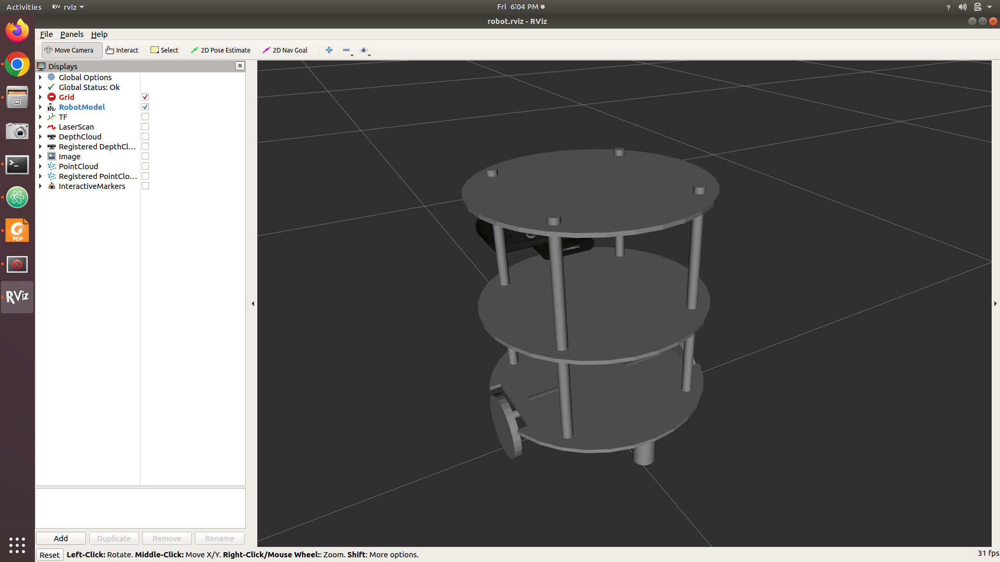

# Robotics - Assignment

# Installation
### Installing ROS Navigation stack
`sudo apt-get install ros-melodic-navigation`

### Running chefbot
`mkdir ~/catkin_ws/src`  
`catkin_create_pkg chefbot_description catkin xacro` 
`catkin build` 
`sudo apt update` 
`sudo apt install ros-melodic-joint-state-publisher-gui` 
 `roslaunch chefbot_description view_robot.launch` 
 

### Running chefbot in gazebo
`sudo apt install ros-melodic-depthimage-to-laserscan -y`
follow the [tutorial](https://automaticaddison.com/how-to-launch-the-turtlebot3-simulation-with-ros/) for turtlebot3 installation in ros melodic 

### Slam gmapping 
Create a 2D occupancy grid map from the laser scan data and the mobile robot pose.

# Problem statement
Write a ROS node (Python or C++) for a differential drive robot in an unknown environment to implement the following trajectory:

### Note:
• Assume that the robot is using navigation stack of ROS.  
• The robot must begin and end its path in the given orientations. 
• Use move_base package to achieve the above solution. 
• Configure all the parameters of move_base required for path planning and obstacle avoidance. 
• Send us the written node along with the configuration files for move_base. 
• Also attach a short report (not more than one page) briefly explaining your approach towards the solution.
