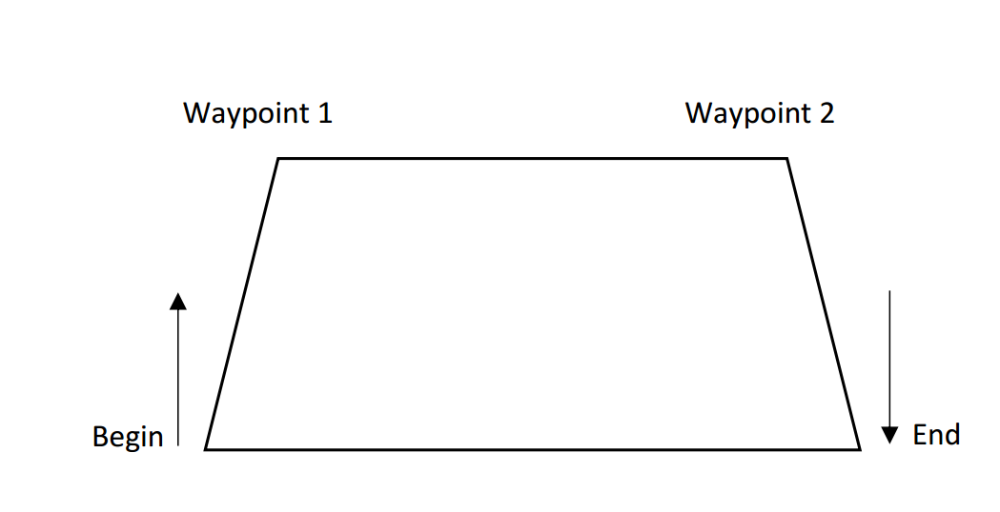
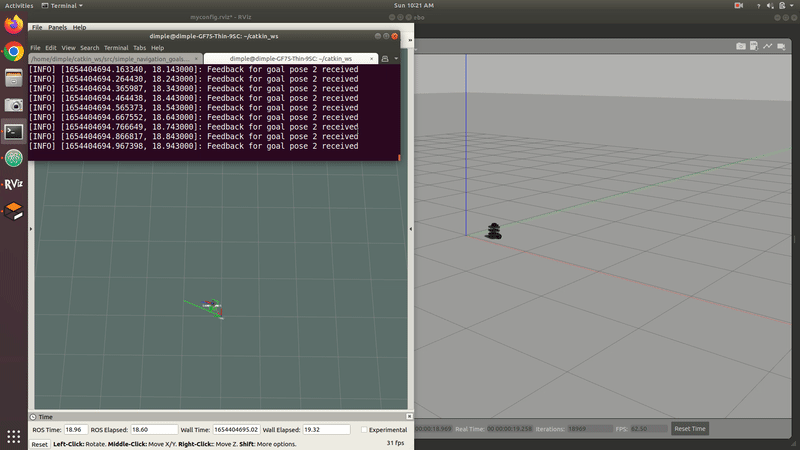
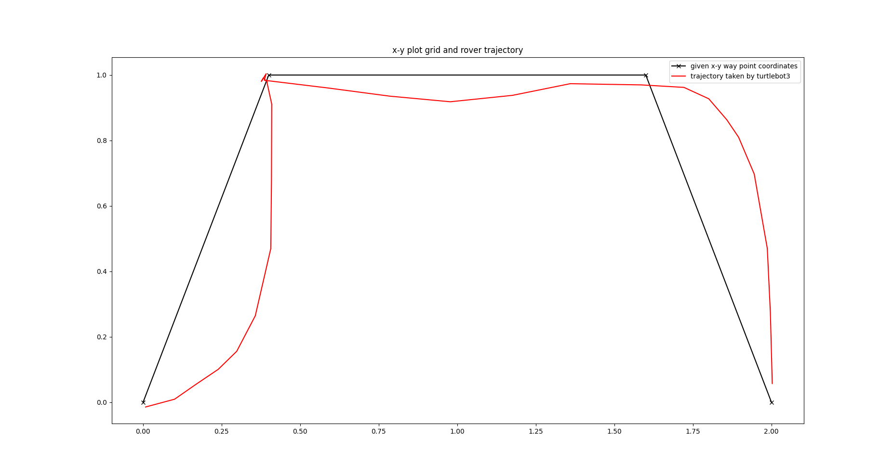
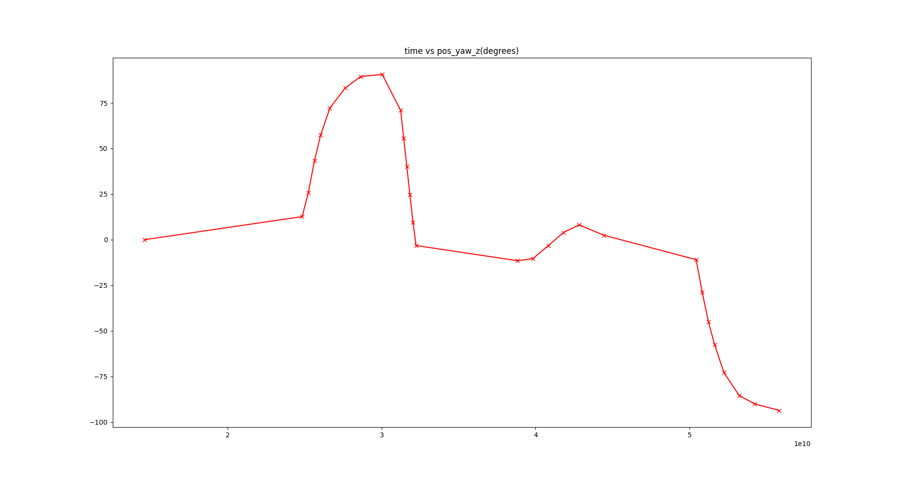
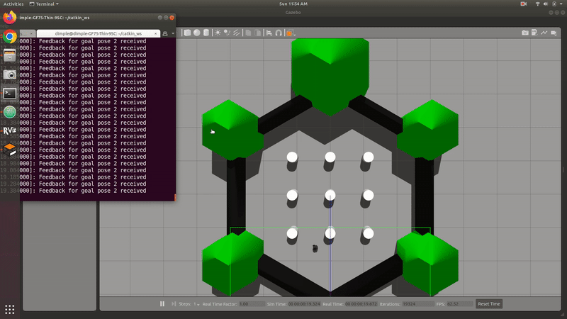
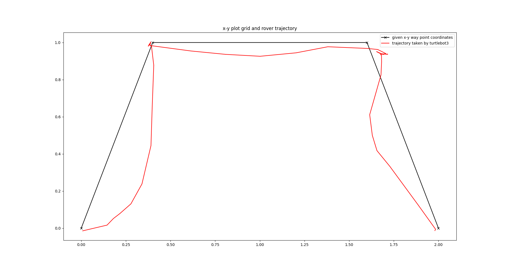

# Robotics - Assignment

# Problem statement
Write a ROS node (Python or C++) for a differential drive robot in an unknown environment to implement the following trajectory:

### Note:
• Assume that the robot is using navigation stack of ROS.  
• The robot must begin and end its path in the given orientations. 
• Use move_base package to achieve the above solution. 
• Configure all the parameters of move_base required for path planning and obstacle avoidance. 
• Send us the written node along with the configuration files for move_base. 
• Also attach a short report (not more than one page) briefly explaining your approach towards the solution.

# Solution
## Turtlebot following a trajectory in empty world in gazebo environment
### Terminal 1
`cd catkin_ws` 
`roslaunch simple_navigation_goals gazebo_navigation_rviz.launch` 
### Terminal 2
`rosrun simple_navigation_goals move_base_wps.py`

|Output of Turtlebot navigating the given waypoints in empty world|
|:------------:|
||
|[Youtube Link](https://youtu.be/ysVizCS7czk)|

## Plotting trajectory (x-y coordinates) taken by the turtlebot (given waypoints) and  yaw angles 
- Recording rosbags of amcl_pose topic  
`rosbag record /amcl_pose`
- Saving rosbag as a text file  
`rostopic echo -p -b 2022-06-05-10-13-46.bag /amcl_pose > pose.txt` 
- Plotting  
`python3 plot_wps.py` 

## Turtlebot trajectory tracking in unknown world

|Output of Turtlebot navigating the given waypoints in unknown world|
|:------------:|
||
|[Youtube Link](https://youtu.be/_c0dAkYNTVg)|

### Run 
Terminal 1: `roslaunch simple_navigation_goals gazebo_navigation_rviz_world.launch`  
Terminal 2: `rosrun simple_navigation_goals move_base_wps.py` 

### Plot of x-y coordinates in unknown world

# Writeup
I have used turtlebot3 (burger model) as my differential drive robot. To install and work with turtlebot3 in ros melodic (ubuntu 18.04) I have followed this [tutorial](https://automaticaddison.com/how-to-launch-the-turtlebot3-simulation-with-ros/).  
To understand how to send goal pose to turtlebot3 using ROS navigation stack, I have used this [tutorial](https://hotblackrobotics.github.io/en/blog/2018/01/29/action-client-py/).  
I have used actionlib library and movebase nodes for my code. 
